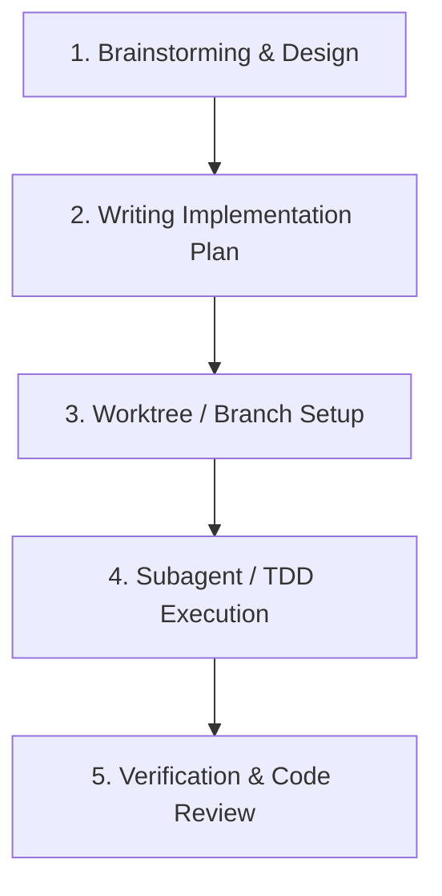

# Superpowers Software Development Methodology

Dự án này áp dụng phương pháp luận phát triển phần mềm **Superpowers** (`https://github.com/obra/superpowers`).
Mọi quy trình phát triển, nâng cấp, sửa lỗi và tái cấu trúc code trên dự án này đều phải tuân thủ nghiêm ngặt các quy tắc dưới đây.

---

## 1. Nguyên Tắc Cốt Lõi (Core Principles)

- **Test-Driven Development (TDD)**: Không bao giờ viết code sản phẩm mà không có test thất bại (RED) trước.
- **Evidence Before Claims**: Không tuyên bố tính năng/bug đã sửa xong khi chưa chạy lệnh kiểm thử và kiểm tra kết quả thực tế.
- **Root Cause Analysis First**: Không thực hiện "sửa nhanh" (quick fix) hay che giấu triệu chứng lỗi. Phải điều tra nguyên nhân gốc rễ trước khi đưa ra phương án sửa.
- **YAGNI & DRY**: Chỉ xây dựng những gì thực sự cần thiết trong kế hoạch, giữ cấu trúc code tinh gọn và tái sử dụng tốt.

---

## 2. Quy Trình 5 Bước Phát Triển Tính Năng (SDLC Workflow)

### Bước 1: Brainstorming (Thiết Kế)
- Trước khi tạo tính năng mới, AI/Engineer phải thảo luận yêu cầu và đưa ra các phương án tiếp cận.
- **Output**: Tài liệu thiết kế lưu tại `docs/superpowers/specs/YYYY-MM-DD-<topic>-design.md`.

### Bước 2: Writing Implementation Plan (Lập Kế Hoạch)
- Chia nhỏ nhiệm vụ thành các sub-task cực nhỏ (2-5 phút thực thi/task).
- Mỗi task phải ghi rõ: Đường dẫn file cần sửa, đoạn code mẫu, và câu lệnh verification.
- **Output**: File kế hoạch lưu tại `docs/superpowers/plans/YYYY-MM-DD-<feature-name>.md`.

### Bước 3: Test-Driven Development (Phát Triển Theo TDD)
- **RED**: Viết test mô tả hành vi mong muốn -> Chạy test và xác nhận test FAILED.
- **GREEN**: Viết mã tối thiểu để test PASSED.
- **REFACTOR**: Tối ưu hóa code nhưng đảm bảo tất cả test vẫn PASSED.

### Bước 4: Systematic Debugging (Quy Trình Sửa Lỗi Systematized)
Khi gặp bug hoặc test fail:
1. Đọc kĩ log lỗi & stack trace.
2. Tái hiện lỗi một cách ổn định.
3. Tìm nguyên nhân gốc rễ (Root cause).
4. Đưa ra giả thuyết -> Kiểm chứng giả thuyết -> Tiến hành sửa.

### Bước 5: Verification & Review
- Chạy toàn bộ câu lệnh kiểm thử.
- Đảm bảo 0 lỗi linting, 0 test fail trước khi hoàn thành công việc.

---

## 3. Cấu Trúc Lưu Trữ Document

- **Design Specs**: `docs/superpowers/specs/`
- **Implementation Plans**: `docs/superpowers/plans/`
- **Skills Instructions**: `docs/superpowers/skills/`
