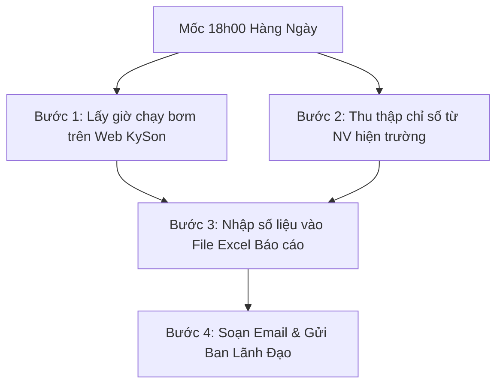

# HƯỚNG DẪN QUY TRÌNH LÀM BÁO CÁO VẬN HÀNH NƯỚC HÀNG NGÀY

---

## I. MỤC ĐÍCH VÀ THỜI GIAN CHỐT SỐ LIỆU

- **Mục đích:** Thống kê, theo dõi tình trạng hoạt động của hệ thống cấp thoát nước, tổng giờ chạy máy bơm, lượng nước tiêu thụ và kịp thời báo cáo Ban Lãnh đạo tình hình vận hành hàng ngày.
- **Mốc chốt số liệu:** Đúng **18h00 hàng ngày**.
- **Khung thời gian thống kê:** Từ **18h00 ngày hôm qua** đến **18h00 ngày hôm nay** (tròn 24 giờ).
- **Sản phẩm đầu ra:** 
  1. File Excel "Báo cáo vận hành nước hàng ngày" đã cập nhật đầy đủ số liệu.
  2. Email báo cáo tổng hợp kèm file Excel gửi Ban Lãnh đạo.

---

## II. QUY TRÌNH THỰC HIỆN CHI TIẾT (4 BƯỚC)

---

### BƯỚC 1: CỘNG GIỜ CHẠY BƠM TỪ HỆ THỐNG TRỰC TUYẾN KYSON

1. **Truy cập hệ thống giám sát:**
   - Đường dẫn Website: [https://kyson.tdh.io.vn/](https://kyson.tdh.io.vn/)
   - Tên đăng nhập (`Username`): `vanhanh`
   - Mật khẩu (`Password`): `vanhanh`

2. **Thao tác lấy dữ liệu:**
   - Vào menu: **Report** (Báo cáo).
   - Thiết lập bộ lọc thời gian:
     - **Từ thời điểm:** `18:00` ngày hôm qua.
     - **Đến thời điểm:** `18:00` ngày hôm nay.
   - Thống kê & Tính tổng: Lấy chỉ số tổng giờ chạy của từng máy bơm / cụm bơm trong khoảng thời gian trên.

3. **Ghi nhận:**
   - Ghi lại số giờ chạy máy bơm đã cộng vào sổ tay/bản nháp để chuẩn bị nhập vào file Excel.

---

### BƯỚC 2: THU THẬP SỐ LIỆU TỪ NHÂN VIÊN VẬN HÀNH HIỆN TRƯỜNG

1. **Thời điểm liên hệ:** Lúc **18h00** hàng ngày, liên hệ Nhân viên vận hành ca trực tại hiện trường (qua Zalo nhóm vận hành / Nhật ký vận hành / App).
2. **Các chỉ số hiện trường cần thu thập bao gồm:**
   - Chỉ số đồng hồ tổng nước cấp (đầu vào).
   - Chỉ số đồng hồ phân phối (nước sinh hoạt, tưới cây, kỹ thuật...).
   - Mực nước bể chứa (Bể ngầm, Bể mái, Bể điều hòa...).
   - Áp lực đường ống tại các khu vực trọng điểm (Bar / PSI).
   - Tình trạng hóa chất xử lý nước (nếu có).
   - Các bất thường hoặc sự cố kỹ thuật phát sinh trong ca trực.
3. **Kiểm tra sơ bộ:** So sánh nhanh chỉ số hôm nay với ngày hôm trước để phát hiện ngay các bất thường (nhập sót số, chênh lệch biến động lớn).

---

### BƯỚC 3: CẬP NHẬT DỮ LIỆU VÀO FILE EXCEL BÁO CÁO

1. **Mở file Excel mẫu:**
   - Đường dẫn/Tên file: File Excel Báo cáo vận hành nước (Template chuẩn của Ban/Phòng).
2. **Điền thông tin:**
   - Cột **Giờ chạy bơm:** Điền dữ liệu đã tính toán ở **Bước 1**.
   - Cột **Chỉ số đồng hồ & Mực nước:** Điền dữ liệu thu thập ở **Bước 2**.
3. **Kiểm tra công thức:**
   - Kiểm tra các ô tự động tính toán (Lượng nước tiêu thụ trong ngày = Chỉ số mới - Chỉ số cũ, Lượng nước bình quân/giờ chạy bơm...).
4. **Lưu file:**
   - Lưu file theo quy tắc đặt tên chuẩn: `Bao_Cao_Van_Hanh_Nuoc_YYYYMMDD.xlsx` *(Ví dụ: `Bao_Cao_Van_Hanh_Nuoc_20260721.xlsx`)*.

---

### BƯỚC 4: SOẠN VÀ GỬI EMAIL BÁO CÁO BAN LÃNH ĐẠO

1. **Định dạng Email:**
   - **Người nhận (To):** Ban Lãnh đạo, Trưởng bộ phận Vận hành.
   - **Đồng kính gửi (Cc):** Ca trực vận hành, Kỹ thuật viên liên quan.
   - **Tiêu đề Email (Subject):** `[BÁO CÁO VẬN HÀNH NƯỚC] - Ngày DD/MM/YYYY`
2. **Nội dung Email (Body):**
   - Lời chào / Thưa gửi Ban Lãnh đạo.
   - **Tóm tắt chỉ số chính trong ngày:**
     - Tổng giờ chạy máy bơm: `... giờ`
     - Tổng lượng nước tiêu thụ: `... m³`
     - Tình trạng vận hành chung: `Hoạt động bình thường / Có sự cố (ghi rõ)`
   - File đính kèm: File Excel báo cáo đã hoàn thiện ở **Bước 3**.
3. **Thời gian gửi:** Hoàn tất và gửi email **trước 18h30** cùng ngày.

---

## III. BẢNG CHECKLIST KIỂM TRA NHANH KHUNG GIỜ 18H00

| STT | Hạng mục công việc | Mốc thời gian | Trạng thái hoàn thành |
| :---: | :--- | :---: | :---: |
| 1 | Lấy giờ chạy bơm trên `https://kyson.tdh.io.vn/` (tài khoản `vanhanh/vanhanh`) | 18h00 - 18h10 | [ ] |
| 2 | Thu thập chỉ số đồng hồ & mực nước từ NV hiện trường | 18h00 - 18h15 | [ ] |
| 3 | Nhập số liệu & đối soát công thức trên File Excel | 18h15 - 18h25 | [ ] |
| 4 | Soạn nội dung, đính kèm Excel & Gửi Email Ban Lãnh Đạo | 18h25 - 18h30 | [ ] |

---

## IV. XỬ LÝ SỰ CỐ THƯỜNG GẶP

1. **Không truy cập được Web KySon:**
   - Kiểm tra lại kết nối mạng.
   - Nếu web lỗi/bảo trì: Yêu cầu Nhân viên hiện trường đọc trực tiếp giờ chạy trên đồng hồ/tủ điều khiển máy bơm tại trạm.
2. **Số liệu hiện trường lệch bất thường:**
   - Yêu cầu NV hiện trường chụp ảnh đồng hồ/mực nước thực tế để xác minh lại trước khi điền Excel.
