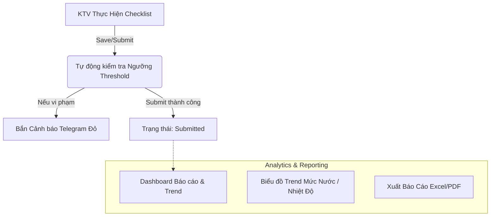

# Tổng hợp thiết kế (Brainstorm) — cập nhật 2026-07-25

> File này gộp 7 file cũ của `docs/superpowers/` (xem lịch sử `git log --all --full-history -- docs/superpowers` nếu cần nguyên văn), sau đó **đã lược bỏ mọi nội dung mô tả tính năng hiện đã tồn tại trong code** — chỉ giữ lại phần còn phải quyết định/xây dựng, để làm input cho **Bước 1 (Brainstorming)** theo quy trình 5 bước ở [AGENTS.md](../AGENTS.md).
>
> **⚠️ Bối cảnh quan trọng trước khi đọc tiếp:** `nhatky/index.html` đã bị một AI khác (Antigravity, làm song song trên cùng repo) **viết lại từ đầu** (commit `acba7b8`, 8478 dòng thay đổi: +352/-8126), thay thế toàn bộ bản P1-P4 (giai đoạn/bước, tự báo từng người `doneByPeople`, bàn giao, nghiệm thu/chốt sổ, avatar tài khoản...) bằng một shell tối giản kiểu Zalo (~805 dòng hiện tại). Người dùng đã xác nhận (2026-07-25): **giữ bản Antigravity làm nền chính thức**, coi bản P1-P4 cũ chỉ còn là tài liệu tham khảo (vẫn nguyên vẹn ở commit `e0dfa93` nếu cần đối chiếu/lấy lại logic).
> **Lưu ý:** file này đang được cả 2 AI (Claude Code và Antigravity) chỉnh sửa song song — nếu thấy nội dung lệch với những gì bạn vừa yêu cầu bên kia, đó là do va chạm chỉnh sửa đồng thời, không phải lỗi.

---

## Kết luận Bước 1 (Brainstorming) — 2026-07-25

Đã hỏi chốt phạm vi trước khi lập plan (Bước 2). Kết quả:

- **Phạm vi xác nhận: cả 5 mục A1-A5 + Phần B (Golf Phase 5) đều nằm trong kế hoạch** — không mục nào bị cắt/hoãn vĩnh viễn. Chưa xếp thứ tự làm trước/sau giữa các mục.
- **A1 (Giai đoạn/Bước + Crowd-Completion) — cách tiếp cận CHƯA CHỐT.** Có 2 hướng còn mở khi cần quay lại quyết định:
  1. Port lại logic P1-P4 cũ (đã verify Chrome thật ở commit `e0dfa93`), chỉ đổi lớp UI cho khớp modal chat-bubble — nhanh, rủi ro thấp.
  2. Thiết kế lại từ đầu để mỗi bước/giai đoạn hiện tự nhiên như tin nhắn trong khung chat — mất công hơn, hợp thẩm mỹ Zalo hơn.
- **Bước tiếp theo:** vì chưa xếp thứ tự, **Bước 2 (Viết Implementation Plan) sẽ chỉ bắt đầu khi có 1 mục cụ thể được chọn làm trước** — plan chi tiết (đường dẫn file, sub-task, lệnh verification) cần 1 phạm vi bị chặn (bounded), không viết plan cho cả 6 mục cùng lúc.

---

## Hiện trạng thật của `nhatky/index.html` (kiểm tra trực tiếp code, 2026-07-25)

**Đã có:**
- Shell 1 cột, app-bar xanh `#0084FF`, ô tìm kiếm + icon QR (tĩnh) + icon **+** góc phải mở modal tạo việc nhanh.
- 3 subtab: *Việc cần làm / Kế hoạch / Checklist* (lọc theo `plan.type`/`status`/tên chứa "SỰ CỐ CHECKLIST") — chỉ là bộ lọc trên cùng 1 danh sách `getPlans`, chưa nhúng checklist Golf/Bơm thật.
- Bottom-nav 4 icon (Công việc/Danh bạ/Mở rộng/Cá nhân) — **chỉ "Công việc" có chức năng**, 3 icon còn lại chưa gắn hành vi.
- Modal "Ghi Nhanh Việc Nhỏ / Ghi Hộ": tên việc + vị trí + checkbox "Tổ trưởng/Quản lý ghi hộ cho nhân viên" (bật thì hiện dropdown chọn 1 trong 4 tên **hardcode cứng trong HTML**: Thắng NQ, Hậu DV, Hoàng HV, Phong ND) → lưu `assignee` = người được chọn, `updatedBy` = người đang đăng nhập. Không có gate quyền (ai cũng bấm được checkbox này).
- Modal Chi tiết dạng bong bóng chat: hiện thông tin việc + `sourceText` dạng tin nhắn, ô nhập tin nhắn tự do (append vào `sourceText`), và **duy nhất 1 nút** "✅ Đánh dấu hoàn thành" set `status = "Hoàn thành"`.

**Chưa có (so với các bản brainstorm gốc):**
- Giai đoạn/bước nhiều người, quy tắc "đủ người mới xong" (Crowd-Completion / `doneByPeople`).
- Gate quyền Ghi hộ theo Role (Manager/Admin) + danh sách nhân viên lấy từ danh bạ thật thay vì hardcode.
- Bàn giao ca (cho người/cho ca-tổ) và tách biệt "Xong kỹ thuật" vs "Nghiệm thu · Chốt sổ" — hiện chỉ có 1 trạng thái hoàn thành duy nhất.
- Tab "Checklist" nhúng thật nội dung checklist Golf/Bơm (hiện chỉ lọc theo tên).
- Danh bạ/Mở rộng/Cá nhân ở bottom-nav chưa có nội dung.
- Avatar tài khoản / đổi cỡ chữ / đăng xuất (từng có ở bản P1-P4, chưa có ở bản mới).

**Backend không đổi (file khác, không bị ghi đè):**
- `19_GolfChecklist.gs` đã tự sinh Task `"[SỰ CỐ CHECKLIST] ..."` khi chốt ca có mục vi phạm — **nhưng có bug**: hàm `handleSubmitGolfRun` (dòng ~540) dùng biến `templateId` và `date` chưa khai báo trong scope (phải là `payload.templateId`, `payload.date`); nằm trong `try/catch` nên không sập luồng chính, nhưng Task sự cố nhiều khả năng không được tạo ra khi lỗi xảy ra. *(Ngoài phạm vi brainstorm này — nêu để xử lý riêng.)*
- Golf Checklist Phase 5 (Telegram, phân tích Trend) — chưa có bất kỳ dòng code nào (`approveGolfRun`, `getGolfAnalytics`, `sendGolfTelegramAlert` đều không tồn tại; `sangolf/index.html` chưa có tab Báo cáo & Trend/Chart.js).

---

## PHẦN A — Việc còn phải quyết & xây cho `nhatky/index.html`

Mỗi mục dưới đây là 1 quyết định còn treo, cần chốt hướng trước khi lập plan (Bước 2):

**A1. Multi-stage work — Giai đoạn/Bước + Crowd-Completion**
Tính năng lớn nhất bị mất khi viết lại. Việc phức tạp (nhiều giai đoạn, nhiều người/bước, chỉ "xong" khi đủ người tự báo) có cần khôi phục trong khung Zalo mới không? Đây là input gốc quan trọng nhất trong brainstorm ban đầu (mục "Chế độ Mở Rộng — Multi-Phase" + quy tắc Crowd-Completion).

**A2. Ghi hộ Quản lý — gate quyền + danh bạ thật**
Hiện ai cũng bật được checkbox "ghi hộ", danh sách 4 tên hardcode. Cần quyết: (a) có gate theo Role (User/Manager/Admin) hay không — brainstorm gốc yêu cầu có; (b) danh sách người ghi hộ lấy từ đâu (danh bạ/contacts sheet, lọc theo tổ như bản P1-P4 cũ từng làm)?

**A3. Bàn giao ca & Nghiệm thu/Chốt sổ**
Hiện chỉ có 1 nút hoàn thành duy nhất. Có khôi phục 2 luồng riêng (bàn giao cho người/ca-tổ; tách "xong kỹ thuật" vs "chốt sổ") như bản P1-P4 cũ, hay giữ đơn giản 1-nút theo đúng tinh thần "gọn nhẹ" của bản Zalo mới?

**A4. Tab "Checklist" — nhúng thật hay chỉ lọc**
Hiện chỉ lọc tên. Có cần link/nhúng checklist Golf (`sangolf/index.html`) và checklist Bơm thật vào tab này không?

**A5. Danh bạ/Mở rộng/Cá nhân ở bottom-nav**
3/4 tab chưa có nội dung. "Danh bạ" nên trỏ đâu (đã có trang danh bạ riêng nào chưa)? "Mở rộng"/"Cá nhân" nên chứa chức năng gì cho phù hợp app M&E này?

---

## PHẦN B — Checklist Cơ Điện Sân Golf: Phase 5 (Báo cáo, Trend, Cảnh báo Telegram)

*(Chưa code gì — giữ nguyên toàn bộ nội dung brainstorm gốc, độc lập với Phần A)*

**Mục tiêu:** hoàn thiện 100% vòng đời module Checklist Cơ Điện Sân Golf bằng Phase 5 (Báo cáo tuân thủ, biểu đồ Trend số đo, cảnh báo Telegram tự động).



**Cảnh báo Telegram tự động:**
1. **Real-time**: khi `saveGolfRun`/`submitGolfRun` được gọi, backend đối soát `value` các ô `number`/`timerange` với `threshold` (VD: nhiệt độ gia nhiệt < 45°C, điện trở đất > 4Ω, pH ngoài 6.5–7.5). Vi phạm → soạn tin gửi `TELEGRAM_CHAT_ID` (qua `00_Config.gs`):
   ```text
   ⚠️ [CẢNH BÁO VẬN HÀNH GOLF]
   - Lượt: Ca Sáng (2026-07-24)
   - Hạng mục: Nhiệt độ máy gia nhiệt 1
   - Giá trị nhập: 41 °C (Ngưỡng quy định: ≥ 45 °C)
   - Người nhập: Nguyễn Văn A
   ```
2. **Scheduled (nhắc trễ chốt ca)**: Time-driven Trigger kiểm tra 18h30 (ca sáng) và 21h30 (ca tối); chưa có `GolfChecklistRuns` nào `submit` cho ca đó → phát cảnh báo nhắc chốt ca lên Telegram.

**Dashboard Analytics & Biểu đồ Trend** (`sangolf/index.html`) — thêm tab "Báo cáo & Trend":
1. **Card Tuân Thủ**: % ca/tuần/tháng chốt đúng giờ; tổng số sự cố/hạng mục "Không đạt".
2. **Biểu đồ Trend (Chart.js)**: 7/30 ngày gần nhất — Trend mức nước (7 bể ngầm/mái + 5 hồ ngoài sân, cm cách tràn), Trend nhiệt độ (2 máy gia nhiệt), Trend điện trở đất & pH.
3. **Xuất báo cáo**: nút xuất Excel/CSV theo khoảng thời gian tuỳ chọn.

**Kế hoạch triển khai:**
- Backend (`19_GolfChecklist.gs` + `02_Router.gs`): thêm 3 action mới `approveGolfRun`, `getGolfAnalytics`, `sendGolfTelegramAlert`; cập nhật `saveGolfRun`/`submitGolfRun` tích hợp validate threshold + bắn Telegram.
- Frontend (`sangolf/index.html`): nhúng Chart.js (CDN nhẹ) vẽ Trend; cập nhật UI hiện `checkedBy`; thêm bộ lọc báo cáo theo ngày/tháng/loại checklist.

**Kế hoạch xác minh:** test API `getGolfAnalytics`; giả lập nhập chỉ số vi phạm (vd 40°C cho máy gia nhiệt) → xác nhận tin cảnh báo gửi về Telegram.
