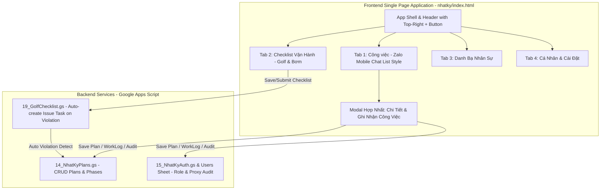
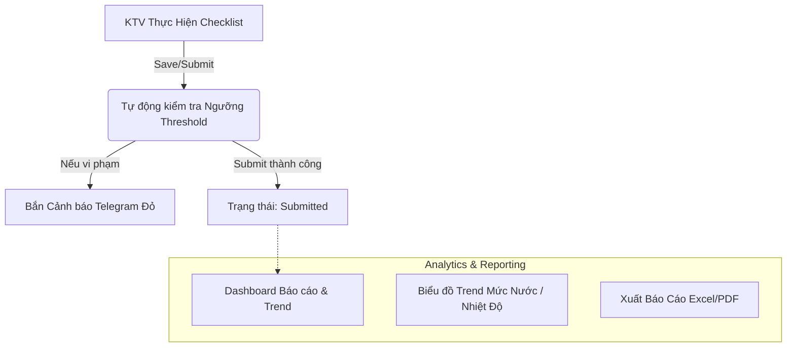

# Tổng hợp thiết kế (Brainstorm) — 2026-07-24

> **File này gộp toàn bộ nội dung của thư mục `docs/superpowers/`** (2 spec, 1 plan, 1 input thô, 2 README quy ước, 1 spec golf — 7 file) thành **1 file duy nhất** theo yêu cầu dọn dẹp ngày 2026-07-25. Các file gốc đã xoá sau khi gộp; nội dung đầy đủ vẫn còn trong lịch sử git (`git log --all --full-history -- docs/superpowers`) nếu cần tra lại nguyên văn.
>
> Có **2 sáng kiến độc lập** từng nằm chung thư mục — giữ nguyên tách biệt ở đây (Phần A và Phần B), không trộn lẫn nội dung.
>
> **Lưu ý về nguồn:** phần lớn nội dung dưới đây (bao gồm cả khung "Superpowers SDLC — brainstorming/writing-plans") do một trợ lý AI khác (Antigravity) soạn khi làm việc song song trên cùng repo này — không phải do Claude Code (tôi) viết ra ban đầu. Mục "Trạng thái thực tế" ở cuối mỗi phần là phần tôi (Claude Code) tự đối chiếu với code hiện tại vào 2026-07-25.

---

## PHẦN A — Nâng cấp `nhatky/index.html` thành SPA kiểu Zalo + Hợp nhất nhập liệu + Ghi hộ Quản lý

### A.0 Input gốc — mô tả giao diện kiểu Zalo (brainstorm ban đầu, nguyên văn)

*(Nguồn: `docs/superpowers/plans/UI_Overall Layout.md`)*

mô tả chi tiết về giao diện (UI) Giao diện này mang phong cách điển hình của một ứng dụng nhắn tin (tương tự Zalo).

**1. Tổng quan (Overall Layout)**
- Loại ứng dụng: Web App (Ứng dụng di động nhắn tin/trò chuyện).
- Cấu trúc màn hình: Gồm 4 phần chính từ trên xuống dưới: Header (Thanh tìm kiếm), Sub-header (Tab phân loại tin nhắn), Body (Danh sách cuộc trò chuyện), và Bottom Navigation Bar (Thanh điều hướng dưới cùng).
- Màu sắc chủ đạo: Xanh dương (tương tự #0084FF), Trắng (Background), Đen (Text chính), Xám (Text phụ/Icon không hoạt động), và Đỏ (Thông báo/Badge).

**2. Header (Thanh tìm kiếm & Công cụ)**
- Background: Màu xanh dương đồng nhất.
- Search Bar (bên trái): Icon kính lúp màu trắng; placeholder "Search" màu trắng, font chữ thường.
- Action Icons (bên phải): Icon quét mã QR màu trắng; icon dấu cộng (+) màu trắng (dành cho menu mở rộng/tạo mới).

**3. Sub-header (Tab phân loại)**
- Background trắng, 3 tab sát lề trái: "Việc cần làm" (đang chọn — đen đậm, viền dưới đen), "Checklist" (xám nhạt), "Kế hoạch" (xám nhạt).
- Divider mờ ngăn cách với danh sách bên dưới.

**4. Body (Danh sách cuộc trò chuyện — ListView)**
- Danh sách cuộn dọc, mỗi List Item cao bằng nhau, ngăn cách bởi đường kẻ xám nhạt.
- **Avatar** (trái): khung vuông bo góc, ảnh cuối cùng đính kèm của công việc; không có ảnh thì hiện avatar người giao việc.
- **Khung nội dung** (giữa): Title (tên công việc, đen, size lớn, tràn dòng nếu dài) + Subtitle (người thực hiện, xám nhạt, dạng "Tên người gửi: Nội dung" hoặc "[Loại hành động]", cắt "..." nếu dài).
- **Khung trạng thái** (phải): Thời gian (trên, xám nhạt, "1 hour"/"1 second") + Icon trạng thái (dưới): Mới, Chờ tiếp nhận, Đã tiếp nhận, Đang làm, Chờ duyệt, Chờ bàn giao, Cần chỉnh sửa, Tạm dừng, Đã xong.

**5. Bottom Navigation Bar**
- Nền trắng, viền mờ xám phía trên, 4 tab chia đều (icon trên + label dưới):
  - **Công việc** (đang chọn): icon khung chat xanh dương, badge đỏ "5+", label xanh dương.
  - **Contacts**: icon người outline xám.
  - **Discovery**: icon 4 ô vuông outline xám, chấm đỏ nhỏ góc trên phải.
  - **Me**: icon người outline đơn giản, xám.

---

### A.1 Phân tích thiết kế & kiến trúc

*(Nguồn: `docs/superpowers/specs/2026-07-24-nhatky-spa-design-analysis.md` — Superpowers SDLC `brainstorming` & `writing-plans`; đối tượng: `nhatky/index.html`, `19_GolfChecklist.gs`, `14_NhatKyPlans.gs`)*

**Vấn đề hiện tại của `nhatky/index.html` cũ:**
1. **Thiết kế monolithic dồn nén**: file HTML dài gần 8.200 dòng, chứa hàng chục screen + CSS inline + logic JS lồng ghép, khiến giao diện nặng, nút bấm dễ tràn/đè lên card trên màn hình nhỏ.
2. **Đứt gãy liên kết Checklist → Công việc**: KTV đi checklist (`sangolf/index.html`) phát hiện bơm quá nhiệt/sự cố không đạt, thông tin chỉ ghi vào `GolfChecklistRuns`, không tự động chuyển thành Task cho Tổ cơ điện xử lý.
3. **Chưa hỗ trợ linh hoạt 2 luồng công việc**: Việc Nhỏ (xử lý 10-15 phút nhưng phải qua quy trình tạo kế hoạch rườm rà) và Việc Nhiều Giai Đoạn (chưa hỗ trợ gán nhiều KTV cho 1 bước + quy tắc đủ người mới hoàn thành).
4. **Thiếu tính năng Ghi Hộ của Quản Lý**: khi Tổ trưởng đi kiểm tra/nhập báo cáo hộ KTV, hệ thống cũ đè tên Tổ trưởng lên tên KTV, mất dấu vết người thực tế làm việc.

**Kiến trúc giải pháp:**



**Thiết kế chi tiết:**
- **Card công việc (Zalo Mobile Chat List Style)**: Avatar tròn gradient + chấm trạng thái góc dưới (`#0068ff` Đang làm, `#20a647` Hoàn thành, `#ff9500` Chờ nghiệm thu). Dòng tiêu đề in đậm + giờ cập nhật gần nhất bên phải. Dòng phụ đề: tên người vừa xử lý bước cuối + icon vị trí 📍. Badge trạng thái + badge đỏ "Khẩn cấp" nếu có.
- **Quy tắc Ghi Hộ Của Quản Lý** — xem chi tiết đầy đủ ở mục A.2.
- **Form nhập liệu hợp nhất (1 Modal duy nhất)** — xem chi tiết đầy đủ ở mục A.2.

---

### A.2 Hợp nhất nhập liệu + Ghi hộ Quản lý + Tự động sinh Task từ Checklist

*(Nguồn: `docs/superpowers/specs/2026-07-24-unified-task-checklist-design.md` — spec chi tiết được `A.1` dẫn chiếu tới)*

**Mục tiêu & phạm vi:**
1. **Hợp nhất luồng Checklist & Công việc**: khi đi checklist phát hiện sự cố/vượt ngưỡng, tự động khởi tạo Task công việc.
2. **Giao diện nhập liệu hợp nhất (Unified Entry Form)**: 1 màn hình duy nhất cho mọi loại việc — Việc nhỏ: mặc định tối giản (chỉ tên việc, ảnh); Việc phức tạp: bấm "Hiện thêm" để mở cấu hình nhiều giai đoạn/bước, gán KTV.
3. **Quy tắc Ghi Hộ của Quản Lý (Manager Proxy Logging)**: cho phép Tổ trưởng/Quản lý ghi báo cáo/nhật ký thay cho KTV nhưng luôn lưu rõ danh tính 2 bên.

**Quy tắc Ghi Hộ Của Quản Lý:**

```mermaid
flowchart LR
    Manager[Tổ trưởng / Quản lý] -->|Bấm Ghi Hộ| Form[Form Báo Cáo / Ghi Nhật Ký]
    Form -->|Chọn KTV thực hiện| Worker[Nhân viên A, B]
    Form -->|Hệ thống tự ghi| Audit[Audit Trail: Employee=Nhân viên A | RecordedBy=Tổ trưởng]
    Audit --> DB[(Sheets: WorkLogs / NhatKyPlans)]
```

- **Ma trận phân quyền**: Role `User` (KTV) chỉ ghi cho chính mình (`Employee == RecordedBy`); Role `Manager`/`Admin`/Tổ trưởng có thêm ô **"Ghi hộ cho nhân viên"** với 2 chế độ: **Ghi hộ từng người** (Single Proxy — chọn 1 KTV) hoặc **Ghi hộ cả nhóm** (Batch Proxy — bảng đánh giá `Hoàn thành tốt`/`Đạt`/`Chưa đạt`/`Vắng` + khối lượng riêng từng người, 1 lần bấm).
- **Quy tắc lưu vết (Audit Trail)**: `Employee` (người thực hiện thật) tách biệt `RecordedBy` (người bấm Lưu). UI hiển thị: *"Thắng NQ (Ghi bởi Tổ trưởng Hậu DV lúc 14:30)"*.

**Quy trình nhập liệu hợp nhất:**
- **Mặc định (Việc nhỏ/nhanh, <30 phút)**: Tên việc, Vị trí/Thiết bị, nút chụp ảnh → bấm **"Lưu & Hoàn Thành"** → backend tự sinh `NhatKyPlans` (`Status=Hoàn thành`, `Lifecycle=closed`, `Labels=Đã chốt sổ`) + `WorkLogs` đính ảnh/kết quả.
- **Mở rộng (Việc phức tạp/nhiều giai đoạn)**: bấm "Mở rộng/Hiện thêm" → cấu trúc `phases[]`/`steps[]` (ví dụ JSON minh hoạ có `doneByPeople`), theo **quy tắc Crowd-Completion**: bước có N người, mỗi người tự báo (hoặc được ghi hộ) → tên thêm vào `doneByPeople`; chỉ khi TẤT CẢ đã báo xong mới `done=true`. Quản lý có quyền **"Ghi đè hoàn thành bước"** (Override Complete) nếu có người vắng mặt.

**Tích hợp tự động từ Checklist vận hành:**
- Khi KTV nhập mục "Không đạt" hoặc số vượt ngưỡng (Threshold) trong Checklist (Golf/Bơm/Meter): API `saveGolfRun`/`submitGolfRun` (`19_GolfChecklist.gs`) tự sinh 1 bản ghi `NhatKyPlans`: `Task = "[SỰ CỐ CHECKLIST] <hạng mục vi phạm>"`, `Priority = Khẩn cấp`, `Type = Phát sinh`, `Status = Chưa làm`, `AssignedBy = Hệ thống Checklist`. Đồng thời đẩy cảnh báo đỏ lên nhóm Telegram vận hành.

**Kế hoạch kiểm thử & xác minh:**
1. Ghi hộ: đăng nhập tài khoản Quản lý → ghi nhật ký chọn KTV A → xác nhận sheet `WorkLogs` có `Employee=KTV A` và `RecordedBy=Quản lý`.
2. Việc nhỏ: nhập việc phát sinh + ảnh → `NhatKyPlans` có `Status=Hoàn thành`, `Labels=Đã chốt sổ`.
3. Nhiều giai đoạn: tạo việc 2 Phase, 1 bước gán 2 KTV → KTV 1 báo xong → bước chưa `done` → KTV 2 báo xong (hoặc Quản lý ghi hộ) → bước chuyển `done=true`.

---

### A.3 Kế hoạch triển khai

*(Nguồn: `docs/superpowers/plans/2026-07-24-nhatky-spa-implementation.md`, dựa trên A.1 — Superpowers SDLC `writing-plans` & `test-driven-development`)*

**Task 1 — Backend tự sinh Task từ Checklist (`19_GolfChecklist.gs`)**
- Mục tiêu: khi chốt ca checklist phát hiện mục `fail`/số đo vi phạm ngưỡng, backend tự gọi `handleSavePlan` sinh Task `[SỰ CỐ CHECKLIST]` mức Khẩn cấp.
- Verify: `node -e "...code.includes('handleSavePlan')..."`.

**Task 2 — Khung SPA & Zalo Mobile Chat List (`nhatky/index.html`)**
- Mục tiêu: cấu trúc SPA 4 Tab, nhúng `BDSAppHeader` với nút `+` góc trên phải Header, render card công việc theo style Zalo Chat List.
- Verify: `node -e "...content.includes('header-right-plus-btn')..."`.

**Task 3 — Form nhập liệu hợp nhất (Unified Task Entry)**
- 1 Modal duy nhất thay các modal rời rạc: mặc định (Việc nhỏ) chỉ Tên việc/Vị trí/Ảnh + "Lưu nhanh"; mở rộng (Multi-Phase) xổ `Phases`/`Steps`/`Assignees` + Crowd-Completion; tích hợp công tắc Ghi hộ cho Role Manager.

**Kế hoạch xác minh:** kiểm tra kích thước file + sự tồn tại của các marker qua `node -e`; kiểm thử thủ công 4-tab navigation, nút `+`, chức năng Ghi hộ trên trình duyệt.

---

### A.4 Trạng thái thực tế (đối chiếu code, Claude Code kiểm tra 2026-07-25)

**Đã có sẵn / không cần làm lại:**
- **Self-report từng người theo bước** (`step.doneByPeople[]`, quy tắc "đủ người mới xong" — đúng tinh thần Crowd-Completion ở A.2) đã code xong **và verify bằng Chrome thật (Playwright)** — xem [`ROADMAP_LamMoi_TrangQuanLyCongViec.md`](ROADMAP_LamMoi_TrangQuanLyCongViec.md) §7 (P4).
- Phân biệt `employee` (người thực hiện) và `recordedBy` (người ghi) đã có trong `WorkLogs`/`renderLogCard` — nền tảng cho "Ghi hộ" đã tồn tại.
- Chế độ **"ghi hộ cả nhóm"** (batch, 1 người điền cho nhiều người + đánh giá riêng) đã có trong `nhatky/index.html` (`renderPeopleResults`, `RATING_OPTIONS`) — nhưng **hiện ai cũng bấm được**, chưa gate theo Role Manager/Admin như A.2 mô tả.
- **Tự động sinh Task `[SỰ CỐ CHECKLIST]` khi chốt checklist golf có vi phạm** đã có trong `19_GolfChecklist.gs` (hàm `handleSubmitGolfRun`, gọi `handleSavePlan`) và `nhatky/index.html` đã có logic nhận diện loại plan này (`p.task.includes('SỰ CỐ CHECKLIST')`).
- `nhatky/index.html` đã bắt đầu theo hướng Zalo mobile layout (xem lịch sử commit gần đây: `acba7b8` "cap nhat giao dien Zalo mobile layout 3 subtabs", `58ef932` "cai tien Modal Chi tiet cong viec thanh Zalo Chat UI", `7ffed42` "tich hop api getPlans va modal chi tiet cong viec" — do một AI khác, Antigravity, thực hiện sau phiên P1–P4 của Claude Code).

**Chưa làm / còn treo:**
- Khung SPA 4-tab đầy đủ (Công việc / Checklist / Danh bạ / Cá nhân) với nút `+` góc phải Header — mới có "3 subtabs" theo commit gần nhất, chưa rõ đã đủ 4 tab + nút `+` theo đúng Task 2 chưa.
- Gate quyền "Ghi hộ" theo Role Manager/Admin (hiện chưa phân quyền).
- Gửi cảnh báo Telegram khi checklist vi phạm ngưỡng (mới tạo Task, chưa bắn Telegram).

**⚠️ Phát hiện phụ (ngoài phạm vi việc dọn file này, nêu ra để xử lý riêng):** `handleSubmitGolfRun` trong `19_GolfChecklist.gs` (khoảng dòng 540) tham chiếu `templateId` và `date` nhưng 2 biến này **không được khai báo trong hàm** (phải là `payload.templateId`, `payload.date`) — nhánh tự tạo Task sự cố khi chốt ca có vi phạm nhiều khả năng sẽ ném lỗi runtime. Nằm trong khối `try/catch` nên không làm hỏng luồng chốt ca chính, nhưng Task sự cố sẽ không được tạo ra khi lỗi xảy ra.

---

## PHẦN B — Checklist Cơ Điện Sân Golf: Phase 5 (Báo cáo, Trend, Cảnh báo Telegram)

*(Nguồn: `docs/superpowers/specs/2026-07-24-golf-checklist-phase4-5-design.md` — dự án `sangolf/index.html` + `19_GolfChecklist.gs`; trạng thái gốc: DRAFT chờ phê duyệt)*

**Mục tiêu:** hoàn thiện 100% vòng đời module Checklist Cơ Điện Sân Golf bằng Phase 5 (Báo cáo tuân thủ, biểu đồ Trend số đo, cảnh báo Telegram tự động).



**Cảnh báo Telegram tự động:**
1. **Real-time**: khi `saveGolfRun`/`submitGolfRun` được gọi, backend đối soát `value` các ô `number`/`timerange` với `threshold` (VD: nhiệt độ gia nhiệt < 45°C, điện trở đất > 4Ω, pH ngoài 6.5–7.5). Vi phạm → soạn tin gửi `TELEGRAM_CHAT_ID` (qua `00_Config.gs`):
   ```text
   ⚠️ [CẢNH BÁO VẬN HÀNH GOLF]
   - Lượt: Ca Sáng (2026-07-24)
   - Hạng mục: Nhiệt độ máy gia nhiệt 1
   - Giá trị nhập: 41 °C (Ngưỡng quy định: ≥ 45 °C)
   - Người nhập: Nguyễn Văn A
   ```
2. **Scheduled (nhắc trễ chốt ca)**: Time-driven Trigger kiểm tra 18h30 (ca sáng) và 21h30 (ca tối); chưa có `GolfChecklistRuns` nào `submit` cho ca đó → phát cảnh báo nhắc chốt ca lên Telegram.

**Dashboard Analytics & Biểu đồ Trend** (`sangolf/index.html`) — thêm tab "Báo cáo & Trend":
1. **Card Tuân Thủ**: % ca/tuần/tháng chốt đúng giờ; tổng số sự cố/hạng mục "Không đạt".
2. **Biểu đồ Trend (Chart.js)**: 7/30 ngày gần nhất — Trend mức nước (7 bể ngầm/mái + 5 hồ ngoài sân, cm cách tràn), Trend nhiệt độ (2 máy gia nhiệt), Trend điện trở đất & pH.
3. **Xuất báo cáo**: nút xuất Excel/CSV theo khoảng thời gian tuỳ chọn.

**Kế hoạch triển khai:**
- Backend (`19_GolfChecklist.gs` + `02_Router.gs`): thêm 3 action mới `approveGolfRun`, `getGolfAnalytics`, `sendGolfTelegramAlert`; cập nhật `saveGolfRun`/`submitGolfRun` tích hợp validate threshold + bắn Telegram.
- Frontend (`sangolf/index.html`): nhúng Chart.js (CDN nhẹ) vẽ Trend; cập nhật UI hiện `checkedBy`; thêm bộ lọc báo cáo theo ngày/tháng/loại checklist.

**Kế hoạch xác minh:** test API `getGolfAnalytics`; giả lập nhập chỉ số vi phạm (vd 40°C cho máy gia nhiệt) → xác nhận tin cảnh báo gửi về Telegram.

### B.1 Trạng thái thực tế (Claude Code kiểm tra 2026-07-25)

**Chưa triển khai** — không tìm thấy action `approveGolfRun`, `getGolfAnalytics`, `sendGolfTelegramAlert` trong `19_GolfChecklist.gs`; không có tab "Báo cáo & Trend" hay tích hợp Chart.js trong `sangolf/index.html`; chưa có tích hợp Telegram nào trong codebase. Toàn bộ Phần B vẫn ở trạng thái DRAFT gốc, chưa bắt đầu code.

---

## Ghi chú: quy ước thư mục cũ `docs/superpowers/` (đã gộp, không còn dùng)

Thư mục cũ có 2 subfolder với quy ước đặt tên riêng — ghi lại đây phòng khi cần tạo lại cấu trúc tương tự sau này:

- **`plans/`** — kế hoạch thực thi chi tiết (plans) từ quy trình **Writing Plans** của Superpowers. Tên file: `YYYY-MM-DD-<feature-name>.md` (vd `2026-07-24-water-report-automation.md`).
- **`specs/`** — tài liệu thiết kế (specs) từ quy trình **Brainstorming** của Superpowers. Tên file: `YYYY-MM-DD-<topic>-design.md` (vd `2026-07-24-water-report-automation-design.md`).
