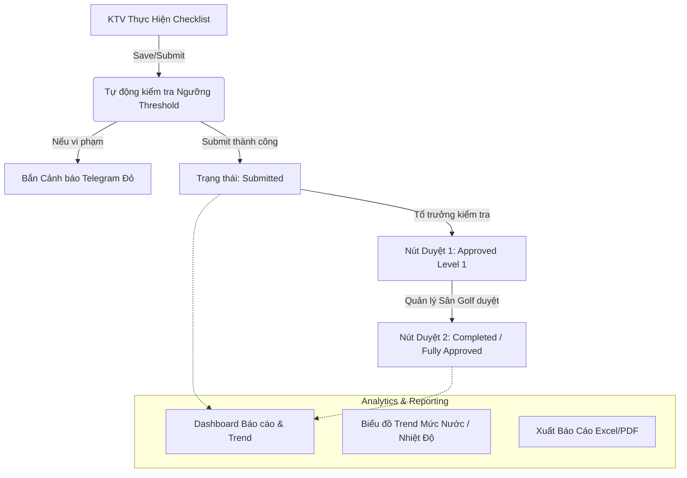

# Design Spec: Hoàn Thiện 100% Vòng Đời Checklist Cơ Điện Sân Golf (Phase 4 & Phase 5)

- **Ngày lập:** 2026-07-24
- **Tác giả:** AI Assistant & Engineering Team
- **Dự án:** BanDienScan / Checklist Golf (`sangolf/index.html` + `19_GolfChecklist.gs`)
- **Trạng thái:** DRAFT — Chờ người dùng xem xét & phê duyệt (Superpowers Brainstorming Step 6)

---

## 1. Tổng quan & Mục tiêu

Hoàn thiện 100% vòng đời của module **Checklist Cơ Điện Sân Golf** bằng cách bổ sung Phase 4 (Phân nhiệm & Duyệt 2 cấp) và Phase 5 (Báo cáo Tuân thủ, Biểu đồ Trend số đo & Cảnh báo Telegram tự động).



---

## 2. Thiết kế Chi tiết Phase 4: Phân Nhiệm & Duyệt 2 Cấp

### 2.1 Cấu trúc Dữ liệu `GolfChecklistRuns` (Google Sheets)
Bổ sung các trường vào `GolfChecklistRuns` và cấu trúc JSON `ItemsJSON`:

- **Trạng thái lượt chạy (`Status`)**:
  - `draft`: Đang ghi nháp.
  - `submitted`: KTV đã hoàn thành & chốt ca/tuần/tháng.
  - `approved_level1`: Tổ trưởng Cơ Điện đã xác nhận.
  - `completed`: Quản lý Sân Golf đã duyệt chính thức.
- **Trường lưu thông tin người duyệt**:
  - `ApprovedByL1`, `ApprovedAtL1` (Tổ trưởng).
  - `ApprovedByL2`, `ApprovedAtL2` (Quản lý sân Golf).
- **Chi tiết từng hạng mục (`ItemsJSON`)**:
  - Mỗi phần tử bổ sung trường `checkedBy` (lấy theo tài khoản Đăng nhập `nhatky auth` hiện tại của KTV nhập mục đó).

### 2.2 Quy trình & UI Duyệt 2 Cấp (Frontend `sangolf/index.html`)
- Màn hình chi tiết lượt checklist hiển thị thanh Tiến trình Duyệt (Workflow Steps):
  `[1. KTV Chốt] -> [2. Tổ Trưởng Xác Nhận] -> [3. Quản Lý Duyệt]`
- Tùy thuộc vào quyền/vai trò người dùng đăng nhập (`currentUser()` từ `15_NhatKyAuth.gs`):
  - **Tổ trưởng**: Thấy nút **"✓ Xác nhận chuyên môn (Tổ trưởng)"**.
  - **Quản lý sân Golf**: Thấy nút **"★ Duyệt chính thức (Quản lý)"**.
- Hỗ trợ ghi chú khi phê xuất hoặc yêu cầu KTV làm lại (Reject / Yêu cầu chỉnh sửa).

---

## 3. Thiết kế Chi tiết Phase 5: Báo cáo, Biểu đồ Trend & Cảnh báo Telegram

### 3.1 Cảnh báo Telegram Tự Động (Real-time & Scheduled)

1. **Cảnh báo tức thì khi vi phạm ngưỡng (Real-time Alert)**:
   - Khi API `saveGolfRun` / `submitGolfRun` được gọi, Backend `19_GolfChecklist.gs` sẽ đối soát `value` của các ô `number` / `timerange` với `threshold` (VD: Nhiệt độ gia nhiệt < 45°C, Điện trở đất > 4Ω, pH ngoài 6.5–7.5).
   - Nếu có vi phạm, tự động soạn tin nhắn Telegram với cú pháp:
     ```text
     ⚠️ [CẢNH BÁO VẬN HÀNH GOLF]
     - Lượt: Ca Sáng (2026-07-24)
     - Hạng mục: Nhiệt độ máy gia nhiệt 1
     - Giá trị nhập: 41 °C (Ngưỡng quy định: ≥ 45 °C)
     - Người nhập: Nguyễn Văn A
     ```
   - Gửi trực tiếp tới `TELEGRAM_CHAT_ID` qua `00_Config.gs`.

2. **Cảnh báo trễ chốt ca (Scheduled Trigger)**:
   - Tạo Time-driven Trigger trong Apps Script kiểm tra lúc 18h30 (Ca sáng) và 21h30 (Ca tối).
   - Nếu chưa có `GolfChecklistRuns` nào được `submit` cho ca đó, tự động phát cảnh báo nhắc nhở chốt ca lên nhóm Telegram.

### 3.2 Dashboard Analytics & Biểu đồ Trend (`sangolf/index.html`)
Bổ sung Tab **"Báo cáo & Trend"** bên cạnh Tab "Checklist":

1. **Card Tuân Thủ**:
   - % số ca/tuần/tháng đã chốt đúng giờ trong tháng.
   - Tổng số sự cố / hạng mục "Không đạt" phát sinh.
2. **Biểu đồ Trend (Chart.js Integration)**:
   - Trực quan hóa diễn biến theo thời gian (7 ngày / 30 ngày gần nhất):
     - **Trend Mức nước**: 7 Bể ngầm/mái + 5 Hồ ngoài sân (cm cách tràn).
     - **Trend Nhiệt độ**: 2 máy gia nhiệt (°C).
     - **Trend Điện trở đất & pH**.
3. **Xuất báo cáo (Export Data)**:
   - Nút xuất file Excel/CSV dữ liệu các lượt checklist theo khoảng thời gian tùy chọn.

---

## 4. Kế hoạch Triển khai (Migration & Backward Compatibility)

1. **Backend (`19_GolfChecklist.gs` + `02_Router.gs`)**:
   - Bổ sung 3 API Actions mới: `approveGolfRun`, `getGolfAnalytics`, `sendGolfTelegramAlert`.
   - Cập nhật hàm `saveGolfRun` / `submitGolfRun` để tích hợp logic validate threshold và bắn thông báo Telegram.
2. **Frontend (`sangolf/index.html`)**:
   - Nhúng thư viện `Chart.js` (qua CDN nhẹ) để vẽ biểu đồ Trend.
   - Cập nhật UI card hạng mục hiển thị tên `checkedBy`.
   - Thêm bộ lọc báo cáo theo ngày/tháng/loại checklist.

---

## 5. Xác minh & Kiểm thử (Verification Plan)

1. **Kiểm thử Unit & API Backend**:
   - Chạy lệnh test kiểm tra kết quả trả về của API `getGolfAnalytics` và `approveGolfRun`.
2. **Kiểm thử Luồng Duyệt 2 cấp & Telegram**:
   - Giả lập nhập chỉ số vi phạm (VD: nhập 40°C cho máy gia nhiệt) -> Xác nhận tin nhắn cảnh báo gửi về Telegram.
   - Thực hiện luồng `Submit` -> `Approve L1` -> `Approve L2` và kiểm tra trạng thái trong Google Sheet `GolfChecklistRuns`.
