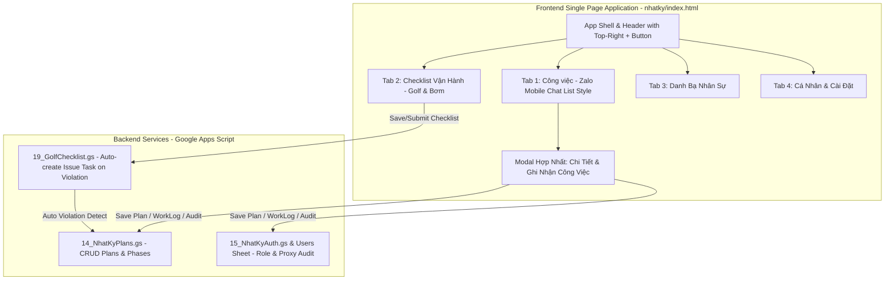

# Design Spec & Architecture Analysis: Nâng Cấp Giao Diện WebApp `nhatky/index.html` Đơn Trang (SPA) & Tích Hợp Chi Tiết

- **Ngày lập:** 2026-07-24
- **Phương pháp luận:** Superpowers SDLC (`brainstorming` & `writing-plans`)
- **Đối tượng:** `02_Source/nhatky/index.html`, `02_Source/19_GolfChecklist.gs`, `02_Source/14_NhatKyPlans.gs`
- **Trạng thái:** BẢN PHÂN TÍCH THIẾT KẾ CHI TIẾT (DESIGN SPEC & ARCHITECTURE ANALYSIS)

---

## 1. PHÂN TÍCH HIỆN TRẠNG & NGUYÊN NHÂN GỐC RỄ (Root Cause & Gap Analysis)

### 1.1 Vấn đề hiện tại của `nhatky/index.html` cũ:
1. **Thiết kế monolithic dồn nén**: File HTML cũ dài gần 8,200 dòng, chứa đồng thời hàng chục screen HTML, CSS inline và logic JS lồng ghép, khiến giao diện bị nặng, nút bấm dễ bị tràn/đè lên Card trên thiết bị màn hình nhỏ.
2. **Đứt gãy liên kết Checklist $\rightarrow$ Công việc**: Khi KTV đi checklist (ở `sangolf/index.html`) phát hiện bơm quá nhiệt hoặc sự cố không đạt, thông tin chỉ được ghi vào `GolfChecklistRuns` mà không tự động chuyển thành Task sự cố cho Tổ cơ điện xử lý.
3. **Chưa hỗ trợ linh hoạt 2 luồng công việc**:
   - **Luồng Việc Nhỏ**: KTV xử lý việc phát sinh trong 10-15 phút nhưng phải trải qua quy trình tạo kế hoạch rườm rà.
   - **Luồng Việc Nhiều Giai Đoạn**: Chưa hỗ trợ gán nhiều KTV cho 1 bước và quy tắc đánh giá đủ người mới hoàn thành.
4. **Thiếu tính năng Ghi Hộ của Quản Lý**: Khi Tổ trưởng đi kiểm tra hoặc nhập báo cáo hộ KTV, hệ thống cũ đè tên Tổ trưởng lên tên KTV, làm mất dấu vết người thực tế làm việc.

---

## 2. KIẾN TRÚC VÀ THIẾT KẾ GIẢI PHÁP (Detailed Architecture & Design)



---

## 3. THIẾT KẾ CHI TIẾT CÁC THÀNH PHẦN (Component Specs)

### 3.1 Giao diện Card Công việc (Zalo Mobile Chat List Style)
- **Avatar & Status Dot**: Dạng hình tròn Gradient, góc dưới có chấm màu biểu thị trạng thái (`#0068ff` Đang làm, `#20a647` Hoàn thành, `#ff9500` Chờ nghiệm thu).
- **Dòng Tiêu Đề (Top Line)**: Tiêu đề công việc in đậm, kết thúc ở bên phải bằng chuỗi thời gian cập nhật gần nhất (`14:20`, `08:15`).
- **Dòng Phụ Đề (Sub Line)**: Tên người vừa cập nhật/xử lý bước cuối (`Thắng NQ: ...`) kèm icon vị trí `📍`.
- **Badge Trạng Thái & Ưu Tiên**: Pill nhỏ gọn thể hiện tên trạng thái và badge đỏ `Khẩn cấp` nếu có.

### 3.2 Quy tắc Ghi Hộ Của Quản Lý (Manager Proxy Logging)
- **Bảng phân quyền**:
  - `Role: User` (KTV): Chỉ báo cáo cho chính mình.
  - `Role: Manager / Admin / Tổ trưởng`: Có cờ bật **"Ghi hộ cho nhân viên"**, hiển thị danh sách KTV trong tổ để chọn 1 KTV (Single Proxy) hoặc chọn cả nhóm (Batch Proxy).
- **Lưu vết Audit**:
  - `Employee`: Tên KTV thực tế làm việc (vd: `Thắng NQ`).
  - `RecordedBy`: Tên người đang đăng nhập bấm Lưu (vd: `Tổ trưởng Hậu DV`).
  - UI hiển thị: *"Thắng NQ (Ghi hộ bởi Tổ trưởng Hậu DV lúc 14:20)"*.

### 3.3 Form Nhập Liệu Hợp Nhất (Unified Task Entry)
Sử dụng **1 Màn hình Modal duy nhất** thay vì phân mảnh:
- **Chế độ Mặc định (Việc Nhỏ / Nhanh)**: Form thu gọn chỉ gồm Tên việc, Vị trí, và Chụp ảnh. Bấm "Lưu & Hoàn Thành" sẽ tự chốt sổ.
- **Chế độ Mở rộng (Multi-Phase)**: Có nút "Hiện thêm" để xổ ra các trường bổ sung: `Phases`, `Steps`, `Assignees`. Áp dụng quy tắc **Crowd-Completion** (tự động chuyển trạng thái `done = true` khi tất cả người được gán hoàn thành).
- **Tích hợp Ghi Hộ**: Form cũng chứa luôn công tắc Ghi hộ dành riêng cho Role Manager.

*(Chi tiết xem thêm tại `2026-07-24-unified-task-checklist-design.md`)*

---

## 4. KẾ HOẠCH BẢO HÀNH & XÁC MINH (Verification Plan)

1. **Cú pháp HTML/JS**:
   Chạy lệnh node kiểm tra cú pháp và sự tồn tại của file SPA:
   ```bash
   node -e "const fs = require('fs'); console.log('File size:', fs.readFileSync('d:/Claude/1_Projects/scan/02_Source/nhatky/index.html', 'utf8').length);"
   ```
2. **Kiểm thử Luồng Nghiệp vụ (Manual & Data Flow)**:
   - Thử nghiệm tạo việc nhỏ 1-Touch $\rightarrow$ Kiểm tra trạng thái tự chốt sổ.
   - Thử nghiệm chọn cờ Ghi Hộ $\rightarrow$ Kiểm tra hiển thị chuỗi danh tính 2 bên trên card.
   - Thử nghiệm chốt ca Checklist có lỗi $\rightarrow$ Kiểm tra tự tạo Task sự cố trong NhatKyPlans.
