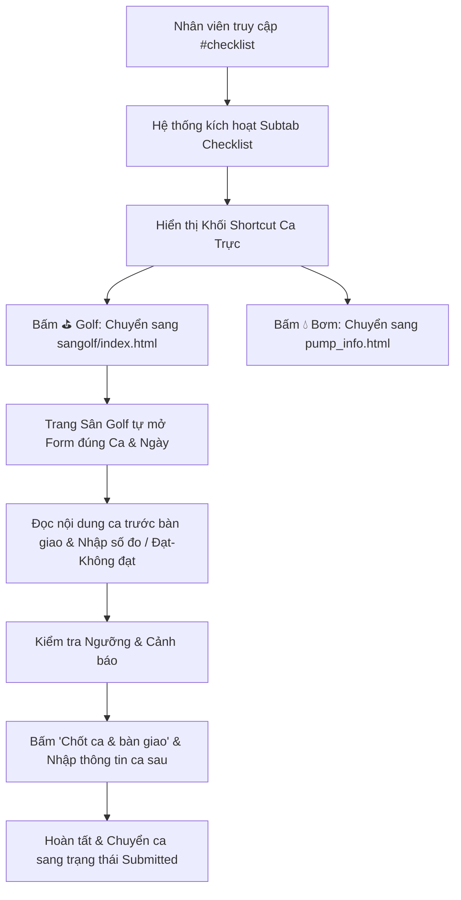

# Thiết Kế: Cập Nhật Luồng Thực Hiện Checklist & Thao Tác Nhân Viên Tại #checklist

Ngày: 2026-08-11  
Phạm vi: Giao diện Nhật Ký (`nhatky/index.html#checklist`) và luồng thao tác của nhân viên vận hành.

---

## 1. Yêu cầu & Bối cảnh

### Bối cảnh hiện tại:
- Nhân viên truy cập URL `https://bandien.github.io/scan/nhatky/index.html#checklist` để xem và làm checklist ca trực.
- Tuy nhiên, bộ điều hướng `handleRoute()` trong `nhatky/index.html` chưa xử lý hash route `#checklist`. Khi vào đường dẫn này, trang web mở màn hình chính (`screenMain`) nhưng giữ `filterTab = 'all'`, khiến subtab `✅ Checklist` không tự kích hoạt và không lọc/hiển thị khu vực Ca trực & Checklist ngay lập tức.
- Nhân viên cần một luồng làm việc mạch lạc từ lúc vào trang Nhật Ký (`#checklist`) ➔ chọn Ca liền trước/sau ➔ chuyển hướng thẳng vào form Checklist Sân Golf/Bơm ➔ thực hiện kiểm tra ➔ chốt ca & bàn giao.

### Mục tiêu:
1. **Cập nhật Hash Routing (`#checklist`)**: Đảm bảo khi truy cập `nhatky/index.html#checklist` (hoặc mở lại từ bookmark/link direct), hệ thống tự động chọn subtab `✅ Checklist`, hiển thị khối shortcut Ca trực và danh sách việc checklist.
2. **Đồng bộ trạng thái Subtab & Hash**: Khi nhân viên chuyển qua lại giữa các subtab (`Công việc`, `📅 Kế hoạch`, `✅ Checklist`), thanh địa chỉ URL cập nhật hash tương ứng (`#`, `#plan`, `#checklist`).
3. **Cập nhật & Chuẩn hóa Luồng Thao tác của Nhân viên**: Document và tối ưu hóa toàn bộ các bước thao tác từ điểm vào `#checklist` tới khi chốt bàn giao ca thành công.

---

## 2. Luồng Thao Tác Của Nhân Viên (User Workflow)

### Các bước thao tác chi tiết:

1. **Bước 1: Truy cập tab Checklist trên Nhật ký (`nhatky/index.html#checklist`)**
   - URL tự động kích hoạt tab `✅ Checklist`.
   - Giao diện hiển thị thẻ thông tin ca trực thời gian thực (Ca liền trước, Ca liền sau) dựa vào thời gian hiện tại (`BD_ChecklistShifts.adjacent()`).
   - Danh sách công việc định kỳ/checklist bên dưới được lọc tự động.

2. **Bước 2: Chọn ca cần điền**
   - Nhân viên bấm nút shortcut `⛳ Golf` để mở Checklist Cơ Điện Sân Golf (`sangolf/index.html?autoTemplate=...&date=...`).
   - Hoặc bấm `💧 Bơm` để mở Nhật ký vận hành Trạm bơm.
   - Nếu là Quản lý/Tổ trưởng, có nút `⚙️ Quản lý mẫu` để điều chỉnh cấu hình mẫu checklist.

3. **Bước 3: Đọc bàn giao ca trước & Thực hiện checklist**
   - Hệ thống tự động load đúng Ca (Sáng/Tối/Đêm) và Ngày nghiệp vụ hợp lệ.
   - Nhân viên đọc ghi chú bàn giao và sự cố còn tồn của ca trước.
   - Điền kết quả từng hạng mục:
     - Chọn `Đạt` / `Không đạt` / `Bỏ qua`.
     - Hoặc nhập số đo thực tế (áp dụng kiểm tra ngưỡng tự động, báo đỏ nếu vượt ngưỡng).
     - Nhập ghi chú xử lý đối với mục không đạt.
   - Thanh tiến độ hiển thị trực quan tỷ lệ hoàn thành (`x/y mục`).

4. **Bước 4: Chốt ca & Bàn giao**
   - Nhân viên nhấn `✓ XÁC NHẬN CHỐT CA & BÀN GIAO`.
   - Nhập thông tin bàn giao cho ca sau (sự cố chưa khắc phục, thiết bị đang chạy, người nhận ca).
   - Xác nhận: Ca chuyển trạng thái sang `submitted`, khóa chỉnh sửa nội dung để bảo toàn tính toàn vẹn trách nhiệm.

---

## 3. Giải Pháp Kỹ Thuật (Implementation Plan)

### File: `nhatky/index.html`

1. **Cập nhật `handleRoute()`**:
   - Thêm nhánh kiểm tra `hash === '#checklist'` và `hash === '#plan'`.
   - Gán `filterTab = 'checklist'` (hoặc `'plan'`).
   - Cập nhật class `.is-active` trên thẻ `.nk-subtab`.
   - Gọi `showScreen('main')` và `renderMainBoard()`.

2. **Cập nhật event listener cho `subtabBar`**:
   - Khi bấm `.nk-subtab`, ngoài việc cập nhật `filterTab` và class `.is-active`, cập nhật `window.location.hash = '#checklist'` (nếu tab là checklist) hoặc `'#plan'` (nếu tab là plan), hoặc xóa hash (nếu tab là all).

3. **Cập nhật / Thêm Automated Test (`tests/nhatky.spec.js`)**:
   - Thêm test case cho Hash Route `#checklist`: kiểm tra khi điều hướng tới `/nhatky/index.html#checklist`, subtab `subtabChecklist` có class `is-active`, và khối `.nk-checklist-shortcuts` hiển thị trên màn hình.

---

## 4. Bằng Chứng Kiểm Thử (Verification Plan)

- Chạy `npx playwright test tests/nhatky.spec.js` để đảm bảo tất cả test cases (bao gồm test hash route `#checklist` mới) đều PASSED.
- Kiểm tra E2E luồng checklist Sân Golf với `npx playwright test tests/golf-checklist.spec.js`.
