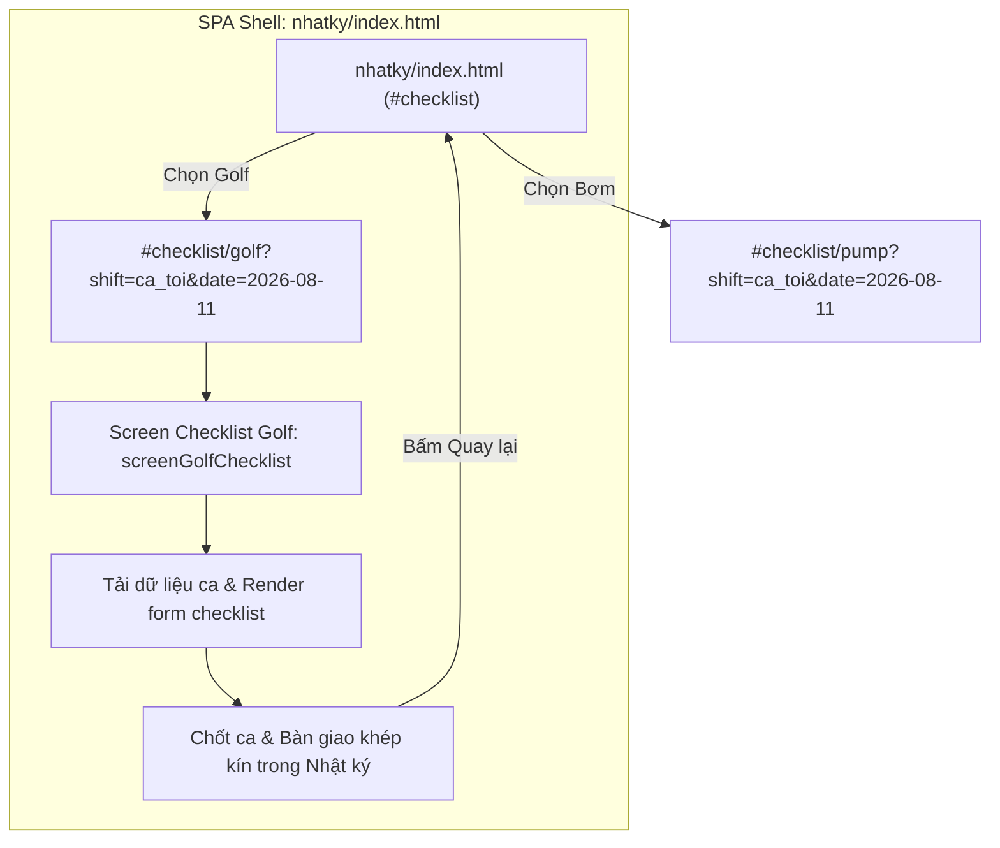

# Thiết Kế: Phân Tích & Tích Hợp Đơn Vị Đường Dẫn Checklist Sân Golf Vào `nhatky/#checklist/golf`

Ngày: 2026-08-11  
Phạm vi: Cấu trúc đường dẫn và luồng điều hướng giữa Nhật Ký (`nhatky/index.html`) và Checklist Sân Golf (`sangolf/index.html`).

---

## 1. Đặt Vấn Đề & Hiện Trạng

### Hiện trạng:
1. Người dùng đang ở màn hình Nhật Ký tại đường dẫn:  
   `https://bandien.github.io/scan/nhatky/index.html#checklist`
2. Khi bấm làm checklist ca trực Sân Golf, trình duyệt bị chuyển hướng sang một đường dẫn trang khác hoàn toàn:  
   `https://bandien.github.io/scan/sangolf/index.html?autoTemplate=ca_toi&date=2026-08-11&returnTo=..%2Fnhatky%2F%23checklist%2Fgolf`

### Yêu cầu đánh giá:
**Có nên đưa việc quản lý & thực hiện Checklist Sân Golf về chung đường dẫn đại diện `https://bandien.github.io/scan/nhatky/#checklist/golf` hay không?**

---

## 2. Phân Tích Đánh Giá Đa Chiều (Brainstorming)

| Tiêu chí | Phương án 1: Tách biệt trang (`sangolf/index.html`) | Phương án 2: Tích hợp vào `nhatky/#checklist/golf` (Khuyên dùng) |
|---|---|---|
| **Trải nghiệm người dùng (UX)** | Phải tải lại toàn bộ trang (Full page reload). Mất ngữ cảnh App Shell của Nhật Ký. | Trải nghiệm ứng dụng đơn trang (SPA) liền mạch. Giữ nguyên thanh tiêu đề, menu điều hướng và nút Quay lại (`‹ Nhật ký`). |
| **Quản lý URL & Routing** | Đường dẫn rời rạc, khó nhớ, tham số URL dài rườm rà (`?autoTemplate=...&returnTo=...`). | Đồng bộ phân cấp logic chuẩn: `#checklist` (Tổng hợp ca) ➔ `#checklist/golf` (Chi tiết ca Golf) ➔ `#checklist/pump` (Trạm Bơm). |
| **Phiên đăng nhập & Cache** | Đọc dữ liệu từ `localStorage` độc lập, có nguy cơ lệch state nếu 1 trang xóa cache. | Dùng chung State Management, SSO Session token và Offline Queue trong một ứng dụng duy nhất. |
| **Bảo trì & Phát triển (Dev)** | Code HTML/CSS/JS nằm ở 2 thư mục riêng (`nhatky/` và `sangolf/`). | Dễ dàng quản lý chung các component chung (AppBar, BottomNav, Toast, Dialogs). |

---

## 3. Đề Xuất Giải Pháp Kiến Trúc: Tích Hợp `nhatky/#checklist/golf`

### Đề xuất: **NÊN ĐƯA VỀ CHUNG ĐƯỜNG DẪN `nhatky/#checklist/golf`**

### Mô hình tích hợp đề xuất:

### Các bước thực thi kỹ thuật chi tiết:

1. **Routing Sub-path**:
   - Nâng cấp Router trong `nhatky/index.html` để nhận diện các hash route phân cấp:
     - `#checklist` ➔ Màn hình danh sách ca trực & lối tắt.
     - `#checklist/golf` (hoặc `#checklist/golf?autoTemplate=...&date=...`) ➔ Màn hình làm Checklist Sân Golf (`screenGolfChecklist`).
     - `#checklist/pump` ➔ Màn hình Checklist Trạm Bơm.

2. **Container nhúng / Màn hình tích hợp (`screenGolfChecklist`)**:
   - Thêm `
` vào `nhatky/index.html`.
   - Nhúng giao diện làm checklist trực tiếp trong App Shell Nhật Ký với thanh AppBar gọn gàng:
     - Nút Quay lại (`‹`) đưa người dùng về ngay `#checklist`.
     - Tiêu đề màn hình: `Checklist Sân Golf · Ca Tối`.
   - Đảm bảo tương thích hoàn toàn với tất cả tính năng hiện có của Sân Golf (chọn Đạt/Không đạt, nhập số đo, kiểm tra ngưỡng, chốt ca bàn giao).

3. **Cơ chế tương thích ngược (Backward Compatibility)**:
   - Nếu người dùng truy cập link cũ `sangolf/index.html?autoTemplate=ca_toi...`, trang Sân Golf sẽ tự động điều hướng mượt sang `nhatky/index.html#checklist/golf?autoTemplate=ca_toi...`.

---

## 4. Kế Hoạch Triển Khai Tiếp Theo

1. **Bước 1**: Nhận phản hồi & duyệt phương án từ phía Quản lý/User.
2. **Bước 2**: Lập kế hoạch thi công (`docs/superpowers/plans/2026-08-11-integrate-golf-checklist-route.md`).
3. **Bước 3**: Tiến hành TDD, thêm container `#screenGolfChecklist` và xử lý hash route `#checklist/golf`.
4. **Bước 4**: Kiểm thử E2E Playwright và bàn giao.
